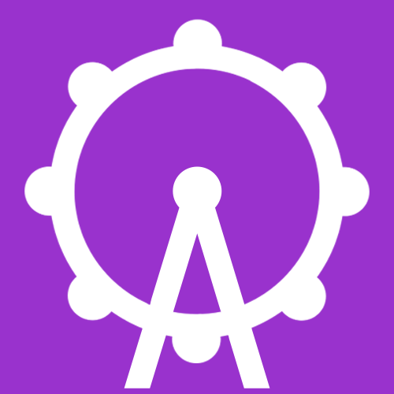

<iframe width="840" height="472" src="https://www.youtube.com/embed/9CdqgrLTZPI" frameborder="0" allow="accelerometer; autoplay; encrypted-media; gyroscope; picture-in-picture" style="margin-bottom: 30px;" allowfullscreen></iframe>

The mobile, digital business card and handout organization system. Recruiters can create resources for events such as career or college fairs, or simply give their information to a potential employee. Students or potential employees can create a packaged portfolio of all they have to offer, from contact information to resumes. Transerring data happens with a single scan.

  
  

When we set out to design MyFair, we wanted to change the way people interacted at career fairs. Previous solutions have tried to simplify the interaction by removing the person to person aspect of business card sharing. Instead of replacing that moment of contact, we wanted to innovate the interpersonal interaction of giving someone a business card. 

